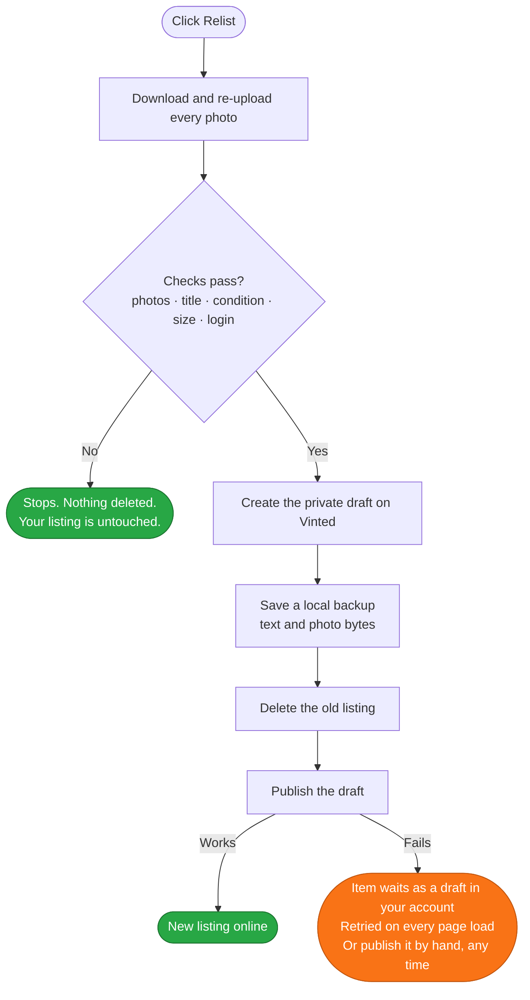

[![Badge Store]][Store]
[![Badge Manifest]][Manifest]
[![Badge Browsers]][Installation]
[![Badge Dependencies]][Source]
[![Badge License]][License]

***

<h1 align="center">
<sub>

</sub>
Bumpline
</h1>

| Browser | Install from ... | Status |
| :-----: | ---------------- | ------ |
|  | <a href="https://chromewebstore.google.com/detail/bumpline/bckdngndomabedcpciejiojhjfheolkn">Chrome&nbsp;Web&nbsp;Store</a> | Published. Installs in one click and updates itself. |
|  | <a href="https://chromewebstore.google.com/detail/bumpline/bckdngndomabedcpciejiojhjfheolkn">Chrome&nbsp;Web&nbsp;Store</a> | Edge runs Chromium and can install from the Chrome Web Store. No separate Edge Add-ons listing. |
|  | — | Not supported. The code targets Chromium's Manifest V3 service worker. |
|  | <a href="https://github.com/g1ampy/Bumpline/releases">GitHub&nbsp;-&nbsp;Releases</a> | The packaged build. Must be unzipped and loaded by hand; it will not auto-update. |

***

Bumpline adds a **Relist** button to your own wardrobe page. Relisting
means deleting a listing and posting it again so it returns to the top of the
search results, which is the only way to make an old item visible again. Vinted
gives you no button for it, so people do it by hand: delete, retype the title,
retype the description, re-pick the brand, the size, the category, the
condition, then download and re-upload every photo. Three to five minutes per
item, and one distraction away from losing it.

Vinted refuses two identical listings online at the same time — it can pull both
down and warn your account. So the old listing **must** be deleted before the
copy goes live. Every naive tool has the same fatal gap: it deletes first, and
if the create call then fails on a network blip or a bot challenge, your item is
gone for good.

**This extension's primary goal is to close that gap.** The copy is saved as a
private draft *before* anything is deleted. A draft is not a listing, so it does
not count as a duplicate, and it sits on Vinted's own servers. By the time the
delete happens, your item exists in two places at once. There is no moment at
which it exists in none.

It is important to note that **Relist as draft is NOT a dry run**. Both buttons
delete the original. The draft variant simply stops before publishing the copy,
so that you can review it first.

***

* [Documentation](#documentation)
* [Installation](#installation)
  * [Chrome Web Store](#chrome-web-store)
  * [From source](#from-source)
  * [Requirements](#requirements)
* [Usage](#usage)
* [Why your item cannot get lost](#why-your-item-cannot-get-lost)
* [Troubleshooting](#troubleshooting)
* [How it works](#how-it-works)
* [Limitations](#limitations)
* [About](#about)

## Documentation

<table>
    <thead>
        <tr>
            <th>Relist</th>
            <th>Relist as draft</th>
        </tr>
    </thead>
    <tbody>
        <tr>
            <td>Deletes the old listing and publishes the copy immediately. The one-click path: you walk away and the item is back at the top.</td>
            <td>Deletes the old listing and leaves the copy unpublished in your Vinted drafts. For when you want to change the price, drop a photo or fix the description before it goes live.</td>
        </tr>
        <tr>
            <td align="center" valign="top"><code>Relisting… → Saving draft… → Deleting… → Publishing…</code></td>
            <td align="center" valign="top"><code>Relisting… → Saving draft… → Deleting…</code></td>
        </tr>
    </tbody>
</table>

Both buttons appear under Vinted's own **Booster** button, on every item you can
still edit:

```
┌────────────────────────────────┐
│   Nintendo Switch Lite    9,00 │
│                                │
│   ┌────────────────────────┐   │
│   │        Booster         │   │  ← Vinted's own button
│   └────────────────────────┘   │
│   ┌────────────────────────┐   │
│   │        Relist          │   │  ← delete, then publish now
│   └────────────────────────┘   │
│   ┌────────────────────────┐   │
│   │    Relist as draft     │   │  ← delete, leave it unpublished
│   └────────────────────────┘   │
└────────────────────────────────┘
```

Sold and reserved items get no buttons at all. Vinted will not let you copy them,
so offering the option would only produce a failure.

The copy keeps the title, description, price, brand, size, category, condition,
colours and every photo, in order.

## Installation

#### Chrome Web Store

[Install Bumpline](https://chromewebstore.google.com/detail/bumpline/bckdngndomabedcpciejiojhjfheolkn) — one click, and it keeps itself up to date. On Edge,
open the same link and allow extensions from other stores when prompted.

#### From source

Use this to run an unreleased change, or to read what you are running. Take the
packaged build from the [Releases] page and unzip it, or clone the source:

```bash
git clone https://github.com/g1ampy/Bumpline
```

1. Open `chrome://extensions` — or `edge://extensions` on Edge.
2. Turn on **Developer mode**, top right.
3. Click **Load unpacked** and select the folder.

After changing any file, click **Reload** on the extension card.

Loaded this way the extension does not auto-update: to move to a newer version,
replace the folder and press **Reload** again.

#### Requirements

Chrome or Edge, and a Vinted account you are logged into. No API key, no build
step, no dependencies, and no network calls to anything except Vinted itself.

## Usage

Open your own Vinted profile — `https://www.vinted.it/member/123456` — find an
item, and click one of the two buttons under **Booster**. When it finishes, the
page reloads.

The button label tells you exactly where it is, so you always know whether you
can still back out:

| Label | What is happening | Can you still back out? |
| ----- | ----------------- | :---------------------: |
| `Relisting…` | Reading the item, downloading and re-uploading photos | Yes |
| `Checking size…` | Asking Vinted which sizes this category accepts | Yes |
| `Waiting for size…` | Waiting for you to pick a size | Yes |
| `Checking…` | Confirming you are logged in and not bot-blocked | Yes |
| `Saving draft…` | Creating the private copy on Vinted | Yes |
| `Deleting…` | Removing the old listing | No — but the draft already exists |
| `Publishing…` | Turning the draft into the new listing | No — retried until it works |
| `Retrying 3/5…` | Publishing failed, trying again | No — retried until it works |

Close the tab at any point before `Deleting…` and your listing is untouched.

If the category now requires a size your old listing never had, a window shows
the real size list pulled from Vinted and asks you to pick one. Nothing is
deleted until you choose.

## Why your item cannot get lost



Before anything is deleted, the extension verifies that every photo uploaded —
not just some of them — that the title is present, that the condition could be
read, that the size is valid for the category, and that you are logged in and
not sitting behind a bot challenge. Any failure stops the run and deletes
nothing.

From the delete onwards, the item exists in two independent places:

| Where | What is stored | Survives |
| ----- | -------------- | -------- |
| Vinted's servers | The full draft, ready to publish | Anything happening to your computer |
| Your browser | The item text and the raw photo bytes | Vinted losing the draft |

If publishing fails, it retries five times with a growing delay, then keeps
retrying every time you open a Vinted page. A box offers three ways out:
**Retry now**, **Download data** — the item as a file — and **Discard**.

Even in the worst case, with the browser closed and the extension uninstalled,
the item is sitting in your Vinted drafts. Open the app and publish it by hand.
This extension is never the only copy.

## Troubleshooting

#### "Blocked by anti-bot"

Vinted thinks you are a robot. Nothing was deleted. Reload the page, turn off ad
and tracker blockers for Vinted, and wait a minute. Logging out and back in
clears it most reliably.

#### The buttons do not appear

Check that you are on **your own** profile page (`/member/...`) on a supported
country site, and reload. If they are still missing, click **Reload** on the
extension in `chrome://extensions`. Remember that sold and reserved items never
get buttons.

#### "Only 3/5 photos uploaded"

One photo failed to upload, so the run stopped. **Nothing was deleted.** This is
almost always a network hiccup — wait a moment and click again.

#### A box says the item was not published

Your item is safe as a draft. Click **Retry now**, or open Vinted, go to your
drafts and publish it yourself. Both work.

#### It asks for a size the old listing never had

Vinted made the size mandatory for that category after you posted the item. Bags
and backpacks are the usual case. Pick a size and it goes through; cancel and
nothing is deleted.

## How it works

| File | Job |
| ---- | --- |
| `content.js` | The buttons, the checks, the API calls, the recovery |
| `background.js` | Watches requests to catch the CSRF and anonymous-id tokens |
| `manifest.json` | Permissions and the list of Vinted domains |

Two permissions, both load-bearing:

* `webRequest` — read request headers to catch the CSRF token Vinted requires on
  every write.
* `storage` — remember that token, and hold a relist that has not finished yet.

Photos of an unfinished relist go to IndexedDB on the Vinted domain rather than
extension storage, which is far too small for them.

The order of operations:

```
1. GET    /api/v2/item_upload/items/<id>              read the item
2. POST   /api/v2/photos                              re-upload each photo
3.                                                    run every pre-flight check
4. POST   /api/v2/item_upload/drafts                  create the draft
5.                                                    save the local backup
6. POST   /api/v2/items/<id>/delete                   delete the old listing
7. POST   /api/v2/item_upload/drafts/<id>/completion  publish the draft
```

**Relist as draft** stops after step 6. If step 6 fails, the draft is removed
with `DELETE /api/v2/item_upload/drafts/<id>` so nothing is left lying around.

Every endpoint is built from the page's own `location.origin`, which is why all
[28 Vinted country domains][Domains] work with no configuration.

## Limitations

Vinted can change its site or its API at any time and break this. Bot protection
can block requests unpredictably. The old listing always has to go before the new
one appears — the draft makes that survivable, it does not remove the delete.

Automating Vinted is very likely against their Terms of Service. That is between
you and Vinted, and no software licence changes it.

## About

[GPLv3 License][License]

Free. Open-source. Built because losing a listing to a failed relist is not an
acceptable outcome.

If you ever want to contribute something, the useful thing is a report: which
Vinted country site, which category, and what the button said when it stopped.

Bumpline is an independent project. It is not affiliated with, endorsed by, or
connected to Vinted in any way. "Vinted" is used only to say which site the
extension works on.


<!----------------------------------------------------------------------------->

[Store]: https://chromewebstore.google.com/detail/bumpline/bckdngndomabedcpciejiojhjfheolkn
[Manifest]: https://developer.chrome.com/docs/extensions/reference/manifest
[Installation]: #installation
[Domains]: manifest.json
[Source]: content.js
[License]: LICENSE
[Releases]: https://github.com/g1ampy/Bumpline/releases

<!----------------------------------[ Badges ]--------------------------------->

[Badge Store]: https://img.shields.io/badge/chrome%20web%20store-available-%2328A745?labelColor=%23282f37
[Badge Manifest]: https://img.shields.io/badge/manifest-v3-%234285F4?labelColor=%23282f37
[Badge Browsers]: https://img.shields.io/badge/chrome%20%7C%20edge-supported-%2328A745?labelColor=%23282f37
[Badge Dependencies]: https://img.shields.io/badge/dependencies-0-%236B7280?labelColor=%23282f37
[Badge License]: https://img.shields.io/badge/license-GPL--3.0-%23A31F34?labelColor=%23282f37
