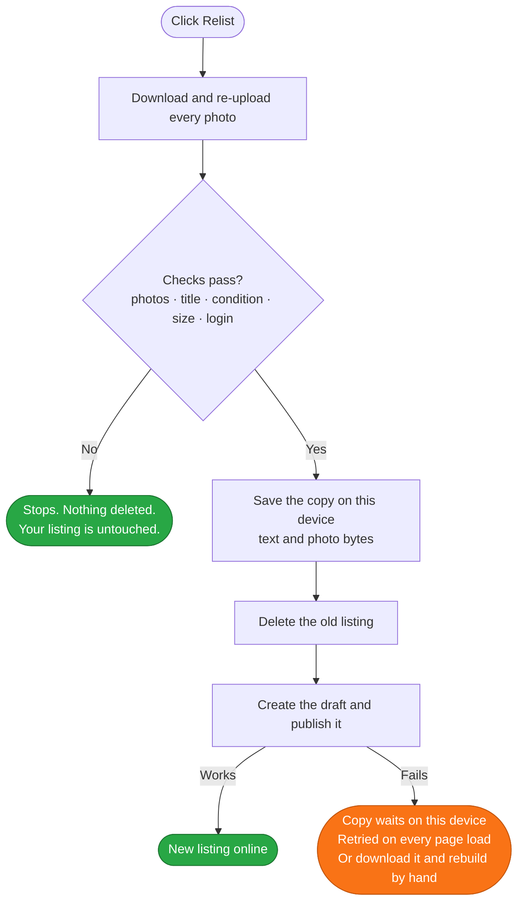

[![Badge Store]][Store]
[![Badge Manifest]][Manifest]
[![Badge Browsers]][Installation]
[![Badge Dependencies]][Source]
[![Badge License]][License]

***

<h1 align="center">
<sub>

</sub>
Bumpline
</h1>

| Browser | Install from ... | Status |
| :-----: | ---------------- | ------ |
|  | <a href="https://chromewebstore.google.com/detail/bumpline/bckdngndomabedcpciejiojhjfheolkn">Chrome&nbsp;Web&nbsp;Store</a> | Published. Installs in one click and updates itself. |
|  | <a href="https://chromewebstore.google.com/detail/bumpline/bckdngndomabedcpciejiojhjfheolkn">Chrome&nbsp;Web&nbsp;Store</a> | Edge runs Chromium and can install from the Chrome Web Store. No separate Edge Add-ons listing. |
|  | <a href="#firefox">Build&nbsp;from&nbsp;source</a> | Supported from 140. `node build.mjs firefox` writes the package; an Add-ons listing is not up yet. |
|  | <a href="https://github.com/g1ampy/Bumpline/releases">GitHub&nbsp;-&nbsp;Releases</a> | The packaged build. Must be unzipped and loaded by hand; it will not auto-update. |

***

Bumpline adds a **Relist** button to your own wardrobe page. Relisting
means deleting a listing and posting it again so it returns to the top of the
search results, which is the only way to make an old item visible again. Vinted
gives you no button for it, so people do it by hand: delete, retype the title,
retype the description, re-pick the brand, the size, the category, the
condition, then download and re-upload every photo. Three to five minutes per
item, and one distraction away from losing it.

Vinted refuses two identical listings online at the same time — it can pull both
down and warn your account. So the old listing **must** be deleted before the
copy goes live. Every naive tool has the same fatal gap: it deletes first, and
if the create call then fails on a network blip or a bot challenge, your item is
gone for good.

**This extension's primary goal is to close that gap.** The whole copy — every
field and every photo byte — is written to disk inside your browser *before*
anything is deleted, and it stays there until the new listing is live. By the
time the delete happens, your item exists in two places at once. There is no
moment at which it exists in none.

Until 1.0.1 that second place was a private draft on Vinted, created before the
delete. It still is for **Relist as draft**, where the draft is the result, and
for a plain relist if you turn *Keep the copy on this device* off in the popup.
Otherwise the draft is now opened at the moment of publishing — the one point
Vinted's API insists on one — and the copy on your disk is what carries the item
across the delete.

It is important to note that **Relist as draft is NOT a dry run**. Both buttons
delete the original. The draft variant simply stops before publishing the copy,
so that you can review it first.

***

* [Documentation](#documentation)
* [Installation](#installation)
  * [Chrome Web Store](#chrome-web-store)
  * [From source](#from-source)
  * [Firefox](#firefox)
  * [Packaging](#packaging)
  * [Requirements](#requirements)
* [Usage](#usage)
  * [When Vinted says stop](#when-vinted-says-stop)
* [Why your item cannot get lost](#why-your-item-cannot-get-lost)
* [Troubleshooting](#troubleshooting)
* [How it works](#how-it-works)
* [Limitations](#limitations)
* [About](#about)

## Documentation

<table>
    <thead>
        <tr>
            <th>Relist</th>
            <th>Relist as draft</th>
        </tr>
    </thead>
    <tbody>
        <tr>
            <td>Deletes the old listing and publishes the copy immediately. The one-click path: you walk away and the item is back at the top.</td>
            <td>Deletes the old listing and leaves the copy unpublished in your Vinted drafts. For when you want to change the price, drop a photo or fix the description before it goes live.</td>
        </tr>
        <tr>
            <td align="center" valign="top"><code>Relisting… → Saving the copy… → Deleting… → Publishing…</code></td>
            <td align="center" valign="top"><code>Relisting… → Saving draft… → Deleting…</code></td>
        </tr>
    </tbody>
</table>

Both buttons appear under Vinted's own **Bump** button, on every item you can
still edit:

```
┌────────────────────────────────┐
│   Nintendo Switch Lite    9,00 │
│                                │
│   ┌────────────────────────┐   │
│   │          Bump          │   │  ← Vinted's own button
│   └────────────────────────┘   │
│   ┌────────────────────────┐   │
│   │        Relist          │   │  ← delete, then publish now
│   └────────────────────────┘   │
│   ┌────────────────────────┐   │
│   │    Relist as draft     │   │  ← delete, leave it unpublished
│   └────────────────────────┘   │
└────────────────────────────────┘
```

Sold and reserved items get no buttons at all. Vinted will not let you copy them,
so offering the option would only produce a failure.

The copy keeps the title, description, price, brand, size, category, condition,
colours and every photo, in order.

## Installation

#### Chrome Web Store

[Install Bumpline](https://chromewebstore.google.com/detail/bumpline/bckdngndomabedcpciejiojhjfheolkn) — one click, and it keeps itself up to date. On Edge,
open the same link and allow extensions from other stores when prompted.

#### Firefox

Firefox needs a manifest of its own — it runs the background as an event page
rather than a service worker, and every add-on it installs must carry an id. The
build script writes that manifest; the code is the same code.

```bash
node build.mjs firefox
```

1. Open `about:debugging#/runtime/this-firefox`.
2. Click **Load Temporary Add-on** and pick `build/bumpline-<version>-firefox/manifest.json`.

A temporary add-on lasts until Firefox closes. Firefox 140 or newer.

#### From source

Use this to run an unreleased change, or to read what you are running. Take the
packaged build from the [Releases] page and unzip it, or clone the source:

```bash
git clone https://github.com/g1ampy/Bumpline
```

1. Open `chrome://extensions` — or `edge://extensions` on Edge.
2. Turn on **Developer mode**, top right.
3. Click **Load unpacked** and select the folder.

After changing any file, click **Reload** on the extension card.

Loaded this way the extension does not auto-update: to move to a newer version,
replace the folder and press **Reload** again.

#### Packaging

One command writes both a folder to load unpacked and a zip to upload, for
either browser:

```bash
node build.mjs            # chrome and firefox
node build.mjs firefox    # just one
```

It needs Node and nothing else — no package.json, no dependencies. The Firefox
package can be checked against the store's own validator with
`npx web-ext lint --source-dir build/bumpline-<version>-firefox`.

#### Requirements

Chrome, Edge or Firefox, and a Vinted account you are logged into. No API key,
no dependencies, and no network calls to anything except Vinted itself.

## Usage

Open your own Vinted profile — `https://www.vinted.it/member/123456` — find an
item, and click one of the two buttons under **Bump**. When it finishes, the
page reloads.

The button label tells you exactly where it is, so you always know whether you
can still back out:

| Label | What is happening | Can you still back out? |
| ----- | ----------------- | :---------------------: |
| `Cooling down 7s…` | Waiting out the gap since your last relist | Yes |
| `Relisting…` | Reading the item, downloading and re-uploading photos | Yes |
| `Checking size…` | Asking Vinted which sizes this category accepts | Yes |
| `Waiting for size…` | Waiting for you to pick a size | Yes |
| `Checking…` | Confirming you are logged in and not bot-blocked | Yes |
| `Saving draft…` | Creating the private copy on Vinted — draft relists only | Yes |
| `Saving the copy…` | Writing the item and its photos to disk | Yes |
| `Deleting…` | Removing the old listing | No — but the copy already exists |
| `Publishing…` | Creating the draft and turning it into the new listing | No — retried until it works |
| `Retrying 2/2…` | Publishing failed, trying once more | No — retried until it works |

Greyed-out buttons mean the extension has stood down: either Vinted refused
something and it is waiting until asking again is worth it, or the account is
restricted from listing and Vinted says so on your own profile; see [When Vinted
says stop](#when-vinted-says-stop).

The steps do not run back to back. A random pause of about one to two seconds
sits between each request so a relist arrives as a person's traffic rather than
as a burst, and a fresh relist waits ten seconds after the last one. Both are
adjustable in the popup, and both are there because Vinted blocks accounts over
exactly that shape of traffic.

Before the first API call, the extension scrolls to the item card and visits the
item's own page — the same navigation a person would have before editing or
deleting something. Longer pauses sit between the logical phases of a relist
(reading, uploading, deleting, publishing) to match the cadence of someone
stepping through a form, not a script walking a list. Every Vinted API call goes
through the page's own `window.fetch` rather than the content script's isolated
copy, so it carries the same tracking headers a real user's requests carry.

Close the tab at any point before `Deleting…` and your listing is untouched.

Clicking the Bumpline icon in the toolbar tells you whether the buttons are on
the page you are looking at and how many items they are on, lists any relist
that has not finished publishing yet — with a button that reopens the page the
retry runs on — says how many items you have relisted in the last hour and in
the last day, shows any standing pause, and carries four settings:

**Reload the page after a relist.** On by default. The page has to be refreshed
to stop showing the listing that was just deleted and to start showing the copy.
Turn it off if you would rather keep your scroll position and your filters; the
deleted item's card is removed straight away, and the rest of the page stays out
of date until you reload it yourself.

**Wait 10 seconds between relists.** On by default, and the only hard stop
between one deletion and the next. Turning it off asks you to confirm first,
because a run of relists then goes out as fast as the network allows, which is
the pattern Vinted answers with a temporary block on editing and publishing.

**Relist faster.** Off by default. Shortens the random pause between each
request from roughly 0.9–2.4 seconds to 0.25–0.7. Turning it on asks you to
confirm: it makes every relist quicker and makes the traffic look far more like
a script.

**Keep the copy on this device.** On by default, and the subject of the note
further up: a plain relist holds the copy in your browser and only creates a
draft on Vinted when it publishes. Turn it off to park a draft in your Vinted
account before the delete, as versions before 1.0.1 did.

Past eight relists in an hour, or forty in a day, the next one stops and asks
whether you mean it. Two windows rather than one, because an hourly limit on its
own has an obvious hole: seven an hour, all day, never trips it and is
unmistakably a bulk operation. Neither number is Vinted's — Vinted publishes
none — and both are deliberately cautious guesses at where tidying a wardrobe
stops looking like tidying a wardrobe.

### When Vinted says stop

A `429`, or a `403` carrying a bot challenge, is Vinted asking for quiet. Until
1.0.1 nothing acted on it: the button came back enabled, the obvious thing to do
was press it again, and that is how a rate limit that would have passed in
fifteen minutes becomes a day-long block on the account.

The refusal is now written down. Every open Vinted tab disables its buttons and
says so, the pending relists stop retrying themselves, and everything comes back
on its own when the wait is over — fifteen minutes for a `429`, thirty for a
challenge, doubling for each further refusal in the same day up to a ceiling of
six hours. If Vinted sends a `Retry-After` asking for longer, that wins.

Nothing is lost while the pause is on: an unfinished relist keeps its copy and
its banner, and picks up where it left off afterwards. The popup can lift the
pause early, behind the same confirmation as the risky settings, for the case
where the refusal was really something else — being logged out, or one bad
network moment.

A restriction is the other half of it, and it does not have to be walked into.
An account stopped from listing or editing carries the date it runs to in its
own profile payload — it is where the banner Vinted shows you comes from — so
Bumpline reads that field as the wardrobe opens, without a request of its own,
and the buttons are off from the first moment rather than from the first
refusal. That one cannot be lifted: the popup shows no button for it, because
the refusal would come from Vinted whether or not the extension stood down.
If the category now requires a size your old listing never had, a window shows
the real size list pulled from Vinted and asks you to pick one. Nothing is
deleted until you choose.

## Why your item cannot get lost



Before anything is deleted, the extension verifies that every photo uploaded —
not just some of them — that the title is present, that the condition could be
read, that the size is valid for the category, and that you are logged in and
not sitting behind a bot challenge. Any failure stops the run and deletes
nothing.

From the delete onwards the item is held in your browser: the full payload in
extension storage, and the raw photo bytes in IndexedDB. Both survive closing
the tab, closing the browser and restarting the machine, and neither depends on
Vinted having kept anything.

If publishing fails it waits several seconds and tries once more, then stops
pressing and picks the job up again every time you open a Vinted page. A box
offers three ways out: **Retry now**, **Download data** — the item as a file,
which is also the copy to rebuild the listing from by hand — and **Discard**.

**Relist as draft**, and a plain relist with *Keep the copy on this device*
switched off, add a second independent copy: a private draft on Vinted's own
servers, made before the delete. That one survives anything happening to your
computer, and can be published by hand from the Vinted app. It is the stronger
guarantee of the two, and it costs a pair of extra write calls per relist on an
account Vinted is already counting calls on.

## Troubleshooting

#### "Blocked by anti-bot", or the buttons have gone grey

Vinted thinks you are a robot. Nothing was deleted. Since 1.0.1 the extension
answers this by pausing itself — the buttons grey out in every Vinted tab and a
note says when they come back. Wait it out: pressing on is what turns a fifteen
minute pause into a 24-hour block on the account.

If you are sure it was something else, turn off ad and tracker blockers for
Vinted, log out and back in, and lift the pause from the toolbar popup.

If the note says the account is restricted from listing, that is Vinted's own
restriction rather than the extension's caution, and it carries a date. There is
nothing to lift and the popup offers no button for it; the buttons come back by
themselves when it expires.

#### The buttons do not appear

Click the Bumpline icon in the toolbar: it says whether the current tab is a
page the buttons work on. Otherwise check that you are on **your own** profile
page (`/member/...`) on a supported country site, and reload. If they are still missing, click **Reload** on the
extension in `chrome://extensions`. Remember that sold and reserved items never
get buttons.

#### "Only 3/5 photos uploaded"

One photo failed to upload, so the run stopped. **Nothing was deleted.** This is
almost always a network hiccup — wait a moment and click again.

#### A box says the item was not published

Your item is safe as a draft. Click **Retry now**, or open Vinted, go to your
drafts and publish it yourself. Both work.

#### It asks for a size the old listing never had

Vinted made the size mandatory for that category after you posted the item. Bags
and backpacks are the usual case. Pick a size and it goes through; cancel and
nothing is deleted.

## How it works

| File | Job |
| ---- | --- |
| `content.js` | The buttons, the checks, the API calls, the recovery |
| `background.js` | Watches requests to catch the CSRF and anonymous-id tokens |
| `manifest.json` | Permissions and the list of Vinted domains |

Two permissions, both load-bearing:

* `webRequest` — read request headers to catch the CSRF token Vinted requires on
  every write.
* `storage` — remember that token, and hold a relist that has not finished yet.

Photos of an unfinished relist go to IndexedDB on the Vinted domain rather than
extension storage, which is far too small for them.

The order of operations:

```
1. GET    /api/v2/item_upload/items/<id>              read the item
2. POST   /api/v2/photos                              re-upload each photo
3.                                                    run every pre-flight check
4.                                                    save the copy on this device
5. POST   /api/v2/items/<id>/delete                   delete the old listing
6. POST   /api/v2/item_upload/drafts                  create the draft
7. POST   /api/v2/item_upload/drafts/<id>/completion  publish the draft
```

A random pause sits between every numbered call, and steps 6 and 7 are retried
as a pair at most twice.

**Relist as draft** — and a plain relist with *Keep the copy on this device*
switched off — runs step 6 before step 5 instead, which is the order every
version up to 1.0.0 used. The draft relist then stops there. If the delete
fails, the draft is removed with `DELETE /api/v2/item_upload/drafts/<id>` so
nothing is left lying around.

Every endpoint is built from the page's own `location.origin`, which is why all
[28 Vinted country domains][Domains] work with no configuration.

## Limitations

Vinted can change its site or its API at any time and break this. Bot protection
can block requests unpredictably. The old listing always has to go before the new
one appears — the draft makes that survivable, it does not remove the delete.

Automating Vinted is very likely against their Terms of Service. That is between
you and Vinted, and no software licence changes it.

## About

[GPLv3 License][License]

Free. Open-source. Built because losing a listing to a failed relist is not an
acceptable outcome.

If you ever want to contribute something, the useful thing is a report: which
Vinted country site, which category, and what the button said when it stopped.

Bumpline is an independent project. It is not affiliated with, endorsed by, or
connected to Vinted in any way. "Vinted" is used only to say which site the
extension works on.


<!----------------------------------------------------------------------------->

[Store]: https://chromewebstore.google.com/detail/bumpline/bckdngndomabedcpciejiojhjfheolkn
[Manifest]: https://developer.chrome.com/docs/extensions/reference/manifest
[Installation]: #installation
[Domains]: manifest.json
[Source]: content.js
[License]: LICENSE
[Releases]: https://github.com/g1ampy/Bumpline/releases

<!----------------------------------[ Badges ]--------------------------------->

[Badge Store]: https://img.shields.io/badge/chrome%20web%20store-available-%2328A745?labelColor=%23282f37
[Badge Manifest]: https://img.shields.io/badge/manifest-v3-%234285F4?labelColor=%23282f37
[Badge Browsers]: https://img.shields.io/badge/chrome%20%7C%20edge%20%7C%20firefox-supported-%2328A745?labelColor=%23282f37
[Badge Dependencies]: https://img.shields.io/badge/dependencies-0-%236B7280?labelColor=%23282f37
[Badge License]: https://img.shields.io/badge/license-GPL--3.0-%23A31F34?labelColor=%23282f37
